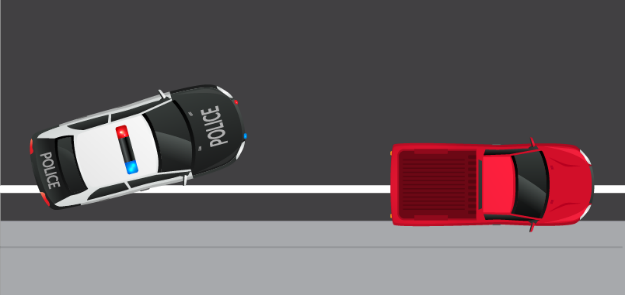

# 🚓 Police

## <mark style="color:blue;">**PD Common Rules**</mark>

1. &#x20;Friendly with civilians/co workers.
2. &#x20;Try to handle situation as calm as possible.
3. &#x20;Don't break the higher official command Also There Will be always a Higher Grade Officer on
   \
   duty So all the allocation to the scenarios will be led by them.
4. Don't play with taser and guns in public areas(especially in front of civilians).
5. &#x20;Be Responsible has PD Officer Also always remember you are a PD officer.
6. &#x20;While communicating always use Sir / Madam (avoid VA da / po da & VA ya / po ya)
7. &#x20;Should not carry confiscated items after processing a suspect Kindly Switch to Main Radio After
   \
   you deposit all the confiscated items.
8. &#x20;Officers should not use Other Officers Vehicles in Scenarios.
9. &#x20;When You are joining radio 1 after a scenario or 10-7 or back from 10-5 Make Sure You are
   \
   ready to respond to the allocated scenario officers should not tell any reasons after they are
   \
   allocated.
10. &#x20;Don't Give random callouts in pd radio to avoid any misleading
11. &#x20;Do not be in PD uniform while in off-duty
12. &#x20;Do not Make changes in Window tint, Tire smoke, neon's.
    \

13. &#x20;Always be in proper uniform allocated to your grade.
14. &#x20;Maintain good hairstyle & color, Black, Brown, White, Mild Red looking like a PD officer.
15. vehicle inspection and inventory check will be done once in a while
    \

16. Don't go AFK after being unconscious or at the time of processing suspects

## <mark style="color:blue;">**CHAIN OF COMMAND**</mark>

**HOD/ NXPD**

* Director of Intelligence Bureau (DIB)&#x20;
* Chief of Intelligence Bureau (CIB)

**Directors**

* Director General of Police (DGP)&#x20;
* Special Director General of Police (SDGP)
* Assistant Director General of Police (ADGP)

**High Command of Police**

* Inspector General of Police (IG)
* Additional Inspector General of Police (ADIG)
* Special Inspector General of Police (SIG)
* Deputy Inspector General of Police (DIG)
* Assistant Inspector General of Police (AIG)

**Commander of Police**

* Senior Superintendent of Police (SSP)
* Superintendent of Police (SP)
* Additional Superintendent of Police (ADSP)
* Deputy Superintendent of Police (DSP)
* Assistant Superintendent of Police (ASP)

**Supervisor of Police**

* Chief Commissioner of Police (CCOM)
* Commissioner of Police (COM)
* Additional Commissioner of Police (ADCP)
* Deputy Commissioner of Police (DCP)
* Assistant Commissioner of Police (ACP)

**Enlisted Police**

* Chief Inspector of Police (CINS)
* Inspector (INS)
* Assistant Inspector (AIP)
* Sub Inspector (SI)
* Assistant Inspector (ASI)
* Head Constable (HC)
* Senior Constable (SC)
* Constable (CONS)

**Probation**

* Trainee (TR)

## <mark style="color:blue;">**NXPD Radio Rules:**</mark>

All police officers must inform their name on radio before going on duty or off duty Example: XXXXX 10-8 (or) 10-7

1. Before or after attending any situation, you must inform via radio.
2. Radio should be used for calling backup & updating situations.
3. Any kind of design or improper callsign / name are not allowed.
4. Avoid unnecessary talk.

<mark style="color:blue;">**#10-Codes**</mark>

10-2 : Arrived on Scene
\
10-3 : On My Way
\
10-4 : Copy That
\
10-5 : Service Break
\
10-6 : Back from Service Break
\
10-7 : Off Duty
\
10-8 : On Duty
\
10-9 : Repeat the message
\
10-10 : Fight in Progress
\
10-20 : Current Location
\
10-25 : Suspect Caught
\
10-31 : Carjacking
\
10-32 : Shots Fired
\
10-33 : Requesting Medical Emergency
\
10-50 : Requesting Officer Backup
\
10-74 : Negative
\
10-75 : Positive
\
10-80 V : Vehicle Pursuit
\
10-80 F : Pursuit on Foot
\

10-90 : Robbery Alarm
\
10-100: Situation Clear

<mark style="color:blue;">**#Vehicle Response Codes**</mark>

* <mark style="color:$success;">Code 1: No lights, no sirens, must obey traffic laws. (Routine patrol)</mark>
* <mark style="color:yellow;">Code 2: Lights on, no sirens. (Responding to crimes / carrying suspects)</mark>
* <mark style="color:$danger;">Code 3: Lights and sirens on. (Urgent response: Robbery, chase)</mark>

<mark style="color:blue;">#</mark><mark style="color:blue;">**MIRANDA RIGHTS**</mark>

“You have the right to remain silent. Anything you
\
say or do, can and will be used against the court of law.”

<mark style="color:blue;">**#SUSPECT**</mark>

A suspect is a person whom the police believe may be guilty of a crime but has not been proven so.

<mark style="color:blue;">**#CRIMINAL**</mark>

A person who has been proven guilty of a crime or has confessed to committing a crime is considered a criminal.

## <mark style="color:$primary;background-color:green;">**Warrant / Bolo Protocol**</mark>

<mark style="color:blue;">**BOLO (Be-On-Look-Out)**</mark>

1. Issued when there is suspicion but no concrete evidence.
2. The suspect **must be invited** for investigation, not arrested on sight.

<mark style="color:blue;">**WARRANT**</mark>

1. Issued **only** when the suspect is confirmed guilty through evidence.
2. Lethal force is permitted **if necessary** during apprehension.
3. For **minor offenses**, issue a **Minor Warrant** – _no kill on sight_.

#### <mark style="color:blue;">**Patrolling Procedure**</mark> 

1. **Notify the officer-in-charge** before starting your patrol.
2. **Follow all traffic laws** while patrolling—set an example for civilians.
3. **Lock your vehicle** whenever you exit it.
4. **Never leave weapons or confiscated items** inside the vehicle.
5. **Do not lend or allow civilians** to use police vehicles under any circumstance.
6. **Use sirens only** during emergencies or active pursuits—avoid unnecessary use.

## <mark style="color:blue;">**Traffic Stop Procedure**</mark> 

1. Use a siren and megaphone to pull over a car.
2. Inform radio about the situation, reason for the pullover, car number, model, and color.
3. Direct the vehicle to stop in a nearby parking area or road shoulder without affecting traffic.
4. Ask them to turn off the engine \[Verify engine is off].
5. Ask only the driver to exit the vehicle; passengers remain inside.
6. Exit your vehicle and speak with the driver; request license, car documents, and discuss the traffic violation.
7. Check case files for any pending warrant/BOLO on the driver and passengers \[If found, follow Terry stop procedure].
8. Issue fine or warning based on the situation.
9. Inform radio when situation is cleared.
10. If driver/passenger has warrant/BOLO, request backup via radio.
11. Wait for backup to arrive.

## <mark style="color:blue;">**Terry Stop Procedure (for warrant/bolo suspects)**</mark> 

1. Pull over the suspect's vehicle safely.
2. Instruct to turn off the engine.
3. Inform dispatch of the Terry stop.
4. Ask the suspect to exit and put their hands up.
5. Request backup (10-50) on dispatch.
6. Cuff the suspect and explain the reason for the stop.
7. If WARRANTED – Process to jail.
8. If BOLO – Take for further investigation.
9. Search the vehicle for suspicious items.
10. Return to PD and process accordingly.

## <mark style="color:blue;">**Hostage Handling**</mark> 

1. Move the hostage to a safe spot.
2. Cuff them for safety.
3. Ask for ID and check for suspicious items.
4. Check for unpaid bills or fines.
5. Provide medical assistance if needed.
6. Investigate the kidnapping story.
7. Arrange taxi or EMS transport to garage.
8. Officer must inspect robbery location.
9. Continue investigation or pursuit as needed.

## <mark style="color:$primary;">IMPOUNDING</mark>

* A vehicle is found illegally parked, you may not search inside it without probable cause but
  \
  you may search their name for later finding.
* A suspect is pulled over due to traffic violations and it’s revealed that they do not
  \
  have a driving license. Driving without a license is a Felony and arrest.
* At the end of a car chase with all suspects either dead or detained, you may search
  \
  the escape vehicle for evidence then you may impound the vehicle.
* A vehicle is stuck and/or irreparable in a risky area like the highway or public city
  \
  roadway

## <mark style="color:blue;">Grounds for Officer Demotion</mark>

* Failure to respond to radio call-outs
* Carrying unauthorized weapons
* Disobeying superior officers' commands
* Unauthorized chopper use
* Unnecessary tasing/shooting of fellow officers
* Radio cross-talk during critical situations
* Traffic law violations (except during robberies/traffic stops)
* Extended PD stays without valid reason
* Improper pursuit formation/unauthorized PIT maneuvers

## <mark style="color:blue;">Chopper Landing Guidelines</mark>

* Land on flat, clear surfaces
* Avoid confined or obstructed areas
* Prevent vehicle damage or accidental deaths during landing
